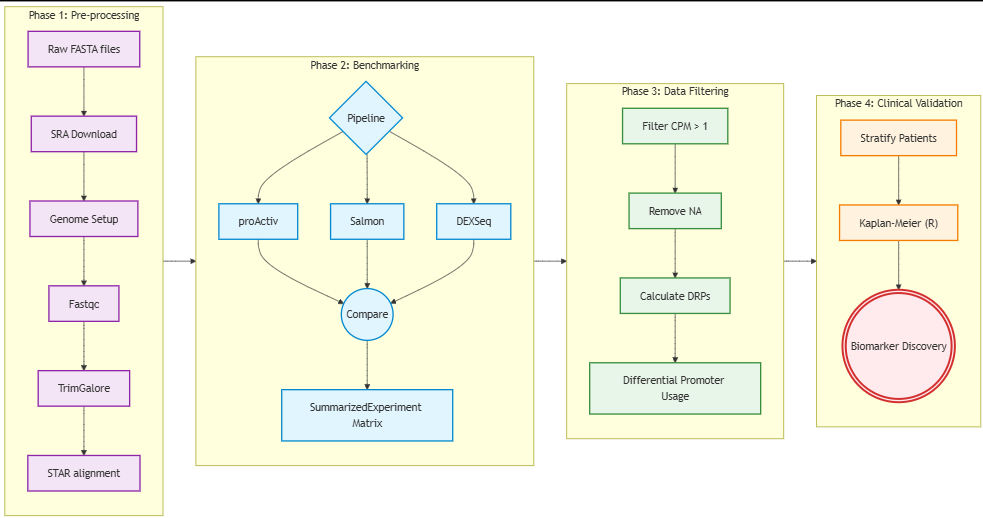
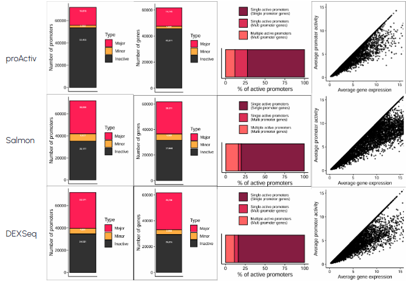

# alternative-promoter-analysis-hcc
Alternative promoter analysis in hepatocellular carcinoma using RNA-seq data.

## Project Overview

Alternative promoter usage is a major source of transcriptomic diversity and plays an important role in diseases such as cancer and heart failure.

In this project, I used the SnakeAltPromoter pipeline to investigate alternative promoter activity from bulk RNA-seq datasets and benchmark three promoter quantification methods:

- proActiv
- Salmon
- DEXSeq

The pipeline was first evaluated using a heart failure dataset and subsequently applied to hepatocellular carcinoma (HCC) samples to identify potential disease-associated alternative promoters and biomarkers.

---

## Research Question

Can promoter-level analysis reveal biologically meaningful regulatory changes that are missed by traditional gene-level RNA-seq analysis?

---

## Objectives

- Compare promoter quantification methods (proActiv, Salmon, DEXSeq)
- Benchmark tool performance on heart failure RNA-seq data
- Identify active alternative promoters in HCC
- Explore promoter-level biomarkers associated with disease
- Investigate the relationship between promoter activity and patient outcomes

---

## Datasets

### GSE147236 (Heart Failure)

- 3 healthy samples
- 4 heart failure samples

### GSE124535 (Hepatocellular Carcinoma)

- 35 HCC samples
- 35 non-tumor samples

Source: NCBI GEO

---

## Analysis Workflow

```text
RNA-seq FASTQ files
        ↓
Quality Control (FastQC)
        ↓
Read Trimming (TrimGalore)
        ↓
Alignment (STAR)
        ↓
Promoter Quantification

 ├── proActiv
 ├── Salmon
 └── DEXSeq

        ↓
Differential Promoter Analysis
        ↓
Alternative Promoter Detection
        ↓
Survival Analysis
        ↓
Biomarker Discovery
```

---

## Tools and Technologies

| Tool | Purpose |
|--------|--------|
| SnakeAltPromoter | Automated workflow |
| FastQC | Quality control |
| TrimGalore | Adapter trimming |
| STAR | Alignment |
| proActiv | Promoter quantification |
| Salmon | Transcript quantification |
| DEXSeq | Exon-level promoter analysis |
| edgeR | Differential analysis |
| limma-voom | Statistical analysis |
| ggplot2 | Visualization |
| SLURM | Job scheduling |
| HPC Cluster | Large-scale computation |

---

## Key Findings

### Tool Comparison

The three promoter quantification methods produced distinct promoter classifications and activity profiles, highlighting the importance of tool selection when studying alternative promoter regulation.

### Alternative Promoters in HCC

Several genes demonstrated evidence of alternative promoter usage, including:

- CD63
- TNS3
- SETBP1

These genes have previously been implicated in cancer biology and may represent promising biomarker candidates.

### Biological Significance

Promoter-level analysis revealed transcriptomic changes that were not evident from traditional gene-level expression analysis, supporting the value of alternative promoter investigation in disease biology.

---

## Results

### Workflow



### Comparison of Promoter Quantification Methods



### Example Biomarker


---

## Skills Demonstrated

- RNA-seq Analysis
- Bioinformatics
- Transcriptomics
- Alternative Promoter Analysis
- Survival Analysis
- High Performance Computing (HPC)
- Linux
- R Programming
- Data Visualization
- Reproducible Research

---

## Repository Structure

```text
├── README.md
├── thesis/
├── presentation/
├── figures/
├── scripts/
├── results/
└── docs/
```

---

## What I Learned

Through this project I gained experience in:

- Processing large-scale RNA-seq datasets
- Running bioinformatics workflows on HPC systems
- Benchmarking computational methods
- Promoter-level transcriptomic analysis
- Statistical interpretation of biological data
- Scientific communication and visualization

---

## Thesis

- Full thesis available in the thesis folder

---

## Author

Rishita Jain

B.Tech Biotechnology

Vellore Institute of Technology (VIT)

Internship: CSIR-Institute of Genomics and Integrative Biology (IGIB)
